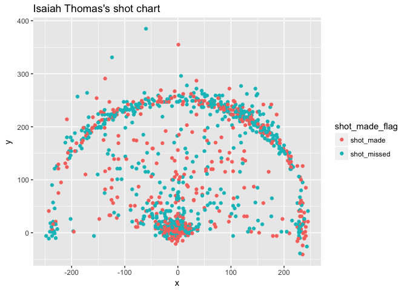
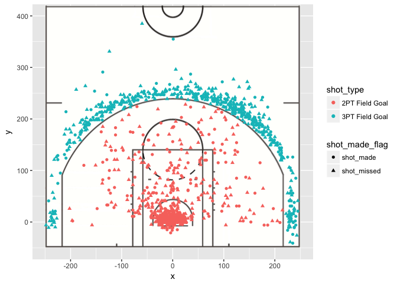
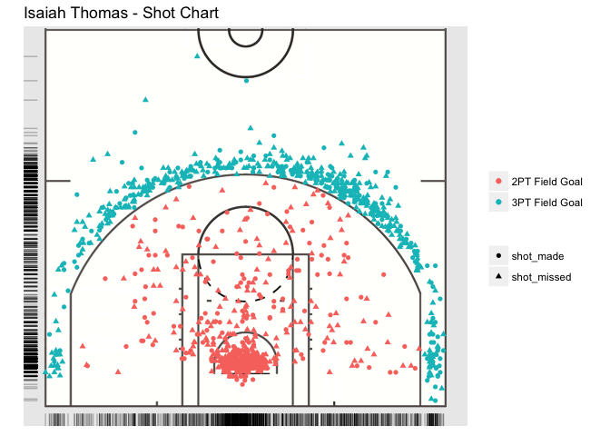
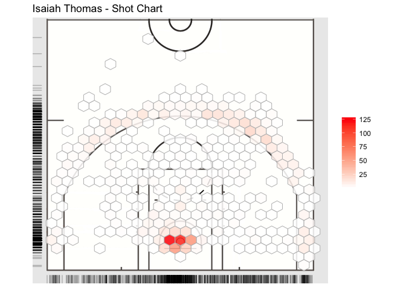

Analyzing and visualizing NBA shot charts for point guards
================
Yoon Sung Hong
10/16/2017

Introduction
------------

In class, we learned to use in game data from NBA and make analysis as well as graphical representation of some of the processed and unprocessed statistics. This post aims to dig deeper into sports statistics and analysis as well as the visualization of it in more game-relevant ways. For example, we want to be able to see how the data extracted applies in context of different areas of the basketball court; how does a player perform closer to the basket? Does a player differ in his performance on the right side of the court compared to the left side of the court? By the end of the post, we should be able to diagramically present advanced NBA data in a more tangible way and analyze the visualized data accordingly. Further, we should be able to utilize some aspects of `ggplot` and other packages such as `jpeg`, \`

You may be asking, *why is this important*? Think from a strategic standpoint. First and foremost, it is easier to **visualize and strategize in-game if data is presented in a relatble manner**; in this case, the basketball court. Second, it will help see the most suitable attacking options as well as defensive options for players. If the data shows that the opponent's player specializes in 3 pointers (for a definition of 3 pointer in basketball, refer to this [link.](https://en.wikipedia.org/wiki/Three-point_field_goal)), a coach may ask for a tighter defense around the 3 point line against the particular player so that he is unable to attempt those 3 pointers frequently. On the other hand, if data and its analysis shows that your player specializes in shooting in the right side of the court, a coach can use this data to command this particular player to play on the right side of the court in offense. These customized tactics and strategies become readily available once we actively analyze the given data and interpret it from a more understandable, diagrammic form.

Some basketball specific strategies
-----------------------------------

For those who may not watch basketball everyday, some of these implemented strategies and tactics may come across as strange to you. So before beginning the data preparation and analysis, I will clarify some of the basic defensive and offensive strategies that may be worth discussing.

> First, when defending, it is generally believed that a tighter defense(i.e. closer distance between the defender and the attacker with the ball) leads to lower shooting percentage. This is statistically relevant, particularly for shots with longer shot distance (dunks or layups, which have barely any shot distance, tend to have higher shooting percentage than jump shots with longer shot distances, so comparing the 'really short-distance' shots to jump shots would be unfair). TLDR: in general, closer the defender is to you, the lower your shot percentage will be. You can read more about these statistical studies [here](https://blog.nycdatascience.com/student-works/r-shiny/investigating-nba-shot-data/).
> Second, when attacking, pick&roll/screens are typical offensive strategies used by a point guard (to generalize). It is a situation where a teammate comes and stands in the way of the defender's path (but has to be standing still) so that the point guard can get past the defender. The easiest way to explain would be through a diagram: 

.

> In the case of the image above, the player numbered 32 is the one setting the screen/pick and roll play. This allows the point guard to either drive into the basket, take a 3 pointer, or take a jump shot closer to the basket. Other things we will discuss as we go along the analysis if needed.

Preparation
-----------

We will first load `ggplot2` and `dplyr` to help us with data analysis and presentation.

``` r
#importing packages and setting the working directory
library(ggplot2)
library(dplyr)
```

    ## 
    ## Attaching package: 'dplyr'

    ## The following objects are masked from 'package:stats':
    ## 
    ##     filter, lag

    ## The following objects are masked from 'package:base':
    ## 
    ##     intersect, setdiff, setequal, union

``` r
setwd("~/stat133/stat133-hws-fall17/post01")
```

As an example, let's only consider players who are point guards with average of 25+ minutes played per game in 2016-17 season. The list of the players with 25+ minutes played can be found by importing the `nba2017-player-statistics,csv` we used previously in hw02. Using this data, we can then mutate a new column for minutes played per game and filter out the players who fit the categories specified above. We will observe and see who we could possibly choose to work with for the data.

``` r
#importing nba2017-player-statistics
mpg_dat <- read.csv("../data/nba2017-player-statistics.csv", colClasses = c("Player" = "character",
                               "Team" = "character",
                               "Experience" = "character",
                                "Position" = "factor",
                                "Salary" = "double"))
#mutating the minutes played per game (mpg)
mpg_dat <- mutate(mpg_dat, mpg = mpg_dat$MIN / mpg_dat$GP )
mpg_dat$mpg <- round(mpg_dat$mpg, 2)
#filtering out the players
player_list <- mpg_dat %>%
  filter(Position == "PG" & mpg > 25) %>%
  select(Player)
player_list
```

    ##                 Player
    ## 1        Isaiah Thomas
    ## 2         Kyrie Irving
    ## 3           Kyle Lowry
    ## 4            John Wall
    ## 5      Dennis Schroder
    ## 6  Matthew Dellavedova
    ## 7          Jeff Teague
    ## 8          Rajon Rondo
    ## 9         Goran Dragic
    ## 10       Tyler Johnson
    ## 11      Reggie Jackson
    ## 12        Kemba Walker
    ## 13        Derrick Rose
    ## 14       Elfrid Payton
    ## 15      T.J. McConnell
    ## 16       Stephen Curry
    ## 17         Tony Parker
    ## 18        James Harden
    ## 19          Chris Paul
    ## 20         George Hill
    ## 21   Russell Westbrook
    ## 22         Mike Conley
    ## 23      Damian Lillard
    ## 24     Emmanuel Mudiay
    ## 25       Jameer Nelson
    ## 26        Jrue Holiday
    ## 27          Seth Curry
    ## 28        Yogi Ferrell
    ## 29     Darren Collison
    ## 30           Ty Lawson
    ## 31         Ricky Rubio
    ## 32    D'Angelo Russell
    ## 33        Eric Bledsoe

``` r
#how many players match the criteria?
nrow(player_list)
```

    ## [1] 33

Unfortunately, it is difficult to collect the data altogether in the NBA stats database. Therefore, we have to collect the individual player's data and assemble it together into a database, using their individual player ID assigned on the NBA website. But in our case, we will only demonstrate and work with one player, Isaiah Thomas.

#### Player ID

-   Isaiah Thomas - 202738

Data processing and presenting
------------------------------

We will download the data from a third-party website called `NBAsavant.com`, who provides the csv file of each of the shot data for players for different seasons.

#### Importing data

``` r
#importing csv file, only classifying columns that we will be using and need reclassification
isaiah <- read.csv("../data/players/nba_savant202738.csv", colClasses = 
                     c("name" = "character",
                       "action_type" = "character",
                       "shot_type" = "character",
                       "shot_made_flag" = "character"
                       ))
str(isaiah)
```

    ## 'data.frame':    1291 obs. of  22 variables:
    ##  $ name             : chr  "Isaiah Thomas" "Isaiah Thomas" "Isaiah Thomas" "Isaiah Thomas" ...
    ##  $ team_name        : Factor w/ 1 level "Boston Celtics": 1 1 1 1 1 1 1 1 1 1 ...
    ##  $ game_date        : Factor w/ 66 levels "2016-10-26","2016-10-27",..: 8 65 22 20 53 57 2 5 42 41 ...
    ##  $ season           : int  2016 2016 2016 2016 2016 2016 2016 2016 2016 2016 ...
    ##  $ espn_player_id   : int  6472 6472 6472 6472 6472 6472 6472 6472 6472 6472 ...
    ##  $ team_id          : int  1610612738 1610612738 1610612738 1610612738 1610612738 1610612738 1610612738 1610612738 1610612738 1610612738 ...
    ##  $ espn_game_id     : int  400899575 400900524 400899833 400899736 400900291 400900340 400899422 400899518 0 400900127 ...
    ##  $ period           : int  1 1 4 1 2 1 2 3 2 2 ...
    ##  $ minutes_remaining: int  5 3 2 2 4 4 1 11 5 1 ...
    ##  $ seconds_remaining: int  16 53 3 44 46 56 14 28 38 30 ...
    ##  $ shot_made_flag   : chr  "1" "1" "0" "1" ...
    ##  $ action_type      : chr  "Cutting Finger Roll Layup Shot" "Cutting Finger Roll Layup Shot" "Cutting Layup Shot" "Cutting Layup Shot" ...
    ##  $ shot_type        : chr  "2PT Field Goal" "2PT Field Goal" "2PT Field Goal" "2PT Field Goal" ...
    ##  $ shot_distance    : int  2 0 2 2 2 1 2 0 2 7 ...
    ##  $ opponent         : Factor w/ 29 levels "Atlanta Hawks",..: 19 21 3 22 1 12 4 5 8 16 ...
    ##  $ x                : int  20 9 25 -27 -22 9 -25 1 -24 -79 ...
    ##  $ y                : int  8 2 7 -5 3 16 7 0 7 11 ...
    ##  $ dribbles         : int  0 0 0 0 0 0 0 0 0 0 ...
    ##  $ touch_time       : num  0 0 0 0 0 0 0 0 0 0 ...
    ##  $ defender_name    : logi  NA NA NA NA NA NA ...
    ##  $ defender_distance: num  0 0 0 0 0 0 0 0 0 0 ...
    ##  $ shot_clock       : num  0 0 0 0 0 0 0 0 0 0 ...

In the dataframe of Isaiah, you're also given the x and y coordinates of every shot taken. We can use this to create a plot showing the shots taken at different locations. We can also label them depending on whether the shots were made or missed. In the csv file and the `shot_made_flag` column, 1 represents a shot made and 0 represents a shot missed.

#### Scatterplot of shots made and missed

``` r
#first, converting the shot_made_flag values from 0 and 1 to made and missed
isaiah$shot_made_flag[isaiah$shot_made_flag == 1] <- "shot_made"
isaiah$shot_made_flag[isaiah$shot_made_flag == 0] <- "shot_missed"
#creating a plot using dataframe
ggplot(isaiah, aes(x = x, y = y)) + geom_point(aes(colour = shot_made_flag)) + ggtitle("Isaiah Thomas's shot chart")
```



#### Commentary

What can we see here? We can see that Isaiah Thomas shoots frequently in the perimeter and close to the rim, but very infrequently in the middle zones, between the 3 point line and the basket. This is likely because Isaiah's disadvantage in height does not give him enough advantage to take those shots in the middle range where he is more likely to be contested.

The plot resembles a shape of a basketball halfcourt, and we can sort of see that. However, we want to distinguish the type of shots attempted as well as where these points lie in relation to the court structure. We can do this by overlaying an image of a basketball court on the `ggplot`, and using packages such as `grid`, `jpeg`, and `RCurl` to obtain the image . We can use `annotation_custom` in `ggplot` to complete the overlay. Let's also set the x limit to be between -250 and 250 and ylimit to be between -50 and 420, to only capture the most common shot situations.

#### Plot with halfcourt image

``` r
#loading packages
library(grid)
library(jpeg)
library(RCurl)
```

    ## Loading required package: bitops

``` r
#downloading the halfcourt image
halfcourt.URL <- "https://thedatagame.files.wordpress.com/2016/03/nba_court.jpg"
halfcourt <- rasterGrob(readJPEG(getURLContent(halfcourt.URL)),
                        width = unit(1, "npc"), height = unit(1, "npc"))
#now performing the ggplot
ggplot(isaiah, aes(x = x, y = y)) + annotation_custom(halfcourt, -250,250,-50,420) + 
  geom_point(aes(colour = shot_type , shape = shot_made_flag)) +
  xlim(-250, 250) +
  ylim(-50, 400)
```



``` r
#let's also save this plot into the image folder
png(file = "../images/isaiah_shotchart.png")
ggplot(isaiah, aes(x = x, y = y)) + annotation_custom(halfcourt, -250,250,-50,420) + 
  geom_point(aes(colour = shot_type , shape = shot_made_flag)) +
  xlim(-250, 250) +
  ylim(-50, 400) +
  ggtitle("Isaiah Thomas - Shot Chart")
dev.off()
```

    ## quartz_off_screen 
    ##                 2

#### Commentary

As a preliminary checkpoint, this plot seems promisiing as all "3PT Field Goal" labeled points are behind the 3 point line in the basketball court diagram. However, this still seems to be in a aspect ratio that is different to the actual basketball court. This is because **coordinates are not fixed** and thus become distorted. We can fix this using the `coord_fixed` function in `ggplot`. I'll also demonstrate \`geom\_rug to show the frequency of the shots in the certain areas and get rid of the x and y labels to make the diagram look cleaner.

#### Another plot

``` r
#replotting using ggplot, this time with some alterations
ggplot(isaiah, aes(x = x, y = y)) + annotation_custom(halfcourt, -250,250,-50,420) + 
  geom_point(aes(colour = shot_type , shape = shot_made_flag)) +
  xlim(-250, 250) +
  ylim(-50, 400) +
  geom_rug(alpha = 0.25) +
  coord_fixed() +
  ggtitle("Isaiah Thomas - Shot Chart") +
  theme(line = element_blank(),
        axis.title.x = element_blank(),
        axis.title.y = element_blank(),
        legend.title = element_blank(),
        axis.text.x = element_blank(),
        axis.text.y = element_blank()
        )
```



``` r
#let's save this one in the folder too
png(file = "../images/isaiah_shotchart2.png")
ggplot(isaiah, aes(x = x, y = y)) + annotation_custom(halfcourt, -250,250,-50,420) + 
  geom_point(aes(colour = shot_type , shape = shot_made_flag)) +
  xlim(-250, 250) +
  ylim(-50, 400) +
  geom_rug(alpha = 0.25) +
  coord_fixed() +
  ggtitle("Isaiah Thomas - Shot Chart") +
  theme(line = element_blank(),
        axis.title.x = element_blank(),
        axis.title.y = element_blank(),
        legend.title = element_blank(),
        axis.text.x = element_blank(),
        axis.text.y = element_blank()
        )
dev.off()
```

    ## quartz_off_screen 
    ##                 2

#### Commentary

Here, we can see that the plot is much cleaner and perfectly resemblant of the half court. As we observed above and here again through the `geom_rug` feature, it seems to be that Isaiah's shots are mostly outside the perimeter(3 pointers) or drive into the basket(layups). This sets a very particular defensive approach needed for Isaiah Thomas: first, guard him tightly without giving too much distance in the perimeter, forcing him to drive into the basket. Second, have someone constantly near the basekt with size to ensure that Isaiah won't have an easy time driving in(Isaiah Thomas is a short player, and is vulnerable to bigger players' physical defense leading to more blocks and contests.)

#### Trying different styles of plots in ggplot

Another style of plot commonly used in NBA statistical analysis community is hexagonal plots. These classify certain shots with similar coordinates into one group and count the frequency of these 'shot regions' by colorizing them. To use this feature, we have to downlaod and load the `hexbin` package and use it instead of `geom_point` in `ggplot` function.

``` r
#loading hexbin package
library(hexbin)
#plot
ggplot(isaiah, aes(x = x, y = y)) + annotation_custom(halfcourt, -250,250,-50,420) + 
  stat_binhex(bins = 25, colour = "gray", alpha = 0.85) +
  scale_fill_gradientn(colours = c("white", "red")) +
  guides(alpha = FALSE, size = FALSE) +
  xlim(-250, 250) +
  ylim(-50, 400) +
  geom_rug(alpha = 0.25) +
  coord_fixed() +
  ggtitle("Isaiah Thomas - Shot Chart") +
  theme(line = element_blank(),
        axis.title.x = element_blank(),
        axis.title.y = element_blank(),
        legend.title = element_blank(),
        axis.text.x = element_blank(),
        axis.text.y = element_blank()
        )
```

    ## Warning: Removed 1 rows containing missing values (geom_hex).



#### Commentary

Here, the frequency is represented by shades of yellow, orange and red. The more red the hexagon is, more frequently a player takes a shot in that spot, and the more white it is, the other way round. Here, we can see that Isaiah's main focus in shooting is close drive ins and 3 pointers, especially on the middle to right side. He seems to particularly favor 3 pointers slightly left or right from the center, so this may be something teams should be aware of when guarding him.

We can also try to aggregate the data, and present the probabilities of the player making the shot in certain areas. We can do this by dividing the shots using the x and y coordinates value. To do this, we should also remove more extreme far range shots (near half court) as these should be treated as outliers. We can exclude these by filtering them out.

Conclusion
----------

It is clear that there is no right or wrong way to present the data visually. ggplot and additional packages such as hexbin clearly offer different ways to quantify and visually present the data. I think through this post, it was realizable that it is important to try to present different forms of graphs and compare them to see which ones apply best to the given data set. For this analysis' case, it was difficult to read the scatterplot version of shot charts as different shapes were hard to distinguish amongst each other. I am certain that different cases with different data frames offer alternate graphical solutions that work best for the analysis; if the purpose of the analysis was to see where the player most frequently shoots in the basketball court, a scatterplot would be more ideal than a hexagonal plot where colors are often too dim to distinguish between each other in frequencies. Therefore, a case-by-case representation of plots would be necessary.

In terms of the analysis itself relating to Isaiah Thomas and his shooting style, it seems very clear that he is either a shooter in the perimeter or a drive-in layup style shooter. In defense's perspective, it is important to guard him tightly in the perimeter and have someone constantly guarding near the basket to stop him from easy layups he frequently attempts. From offense's perspective, it is important to utilize Isaiah's ability in shooting 3s around the middle and right side of the court. Furthermore, using effective screens to allow him to drive to the basket and providing support at the basket to not have Isaiah contested by bigger players, is crucial to scoring points offensively.

### What is the key message?

Graphically presenting things often provide better conceptual/general ideas. However, it is important to make a clear decision about the type of analysis you want to do and the research question you have, so that you can have the most ideal visual representation to look and analyze for the given research question.
